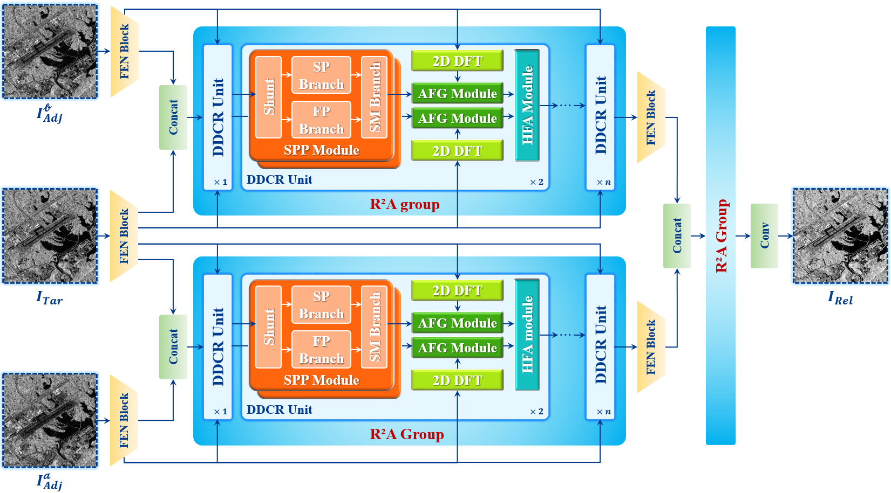

# Enhanced Noise2Noise-Based Multitemporal Progressive Interaction Learning for Real Dual-Polarization SAR Image Despeckling

Official PyTorch implementation of the paper  
**"Enhanced Noise2Noise-Based Multitemporal Progressive Interaction Learning for Real Dual-Polarization SAR Image Despeckling"**

By **Jiangong Xu**, **Yang Yang**, **Weibao Xue**, **Yingdong Pi**, **Junli Li**, **Jun Pan**, and **Mi Wang**  


[]()
[]()

---

## 🚀 Abstract

> Effective speckle suppression is essential for the reliable utilization of synthetic aperture radar (SAR) data. Nevertheless, despeckling remains a challenging task due to the absence of clean reference data and the inherently complex statistical characteristics of speckle noise. To address these limitations, we propose a **Multitemporal Progressive Interaction Network (MTPI-Net)** built upon an enhanced **Noise2Noise** paradigm. MTPI-Net introduces a hierarchical progressive learning strategy that jointly models **spatial, frequency-domain, and temporal dependencies**. It employs dual-domain collaboration and refinement units with a **recursive residual-in-recursive-attention** mechanism, enabling fine-grained cross-domain interaction through *perception*, *gating*, and *aggregation*.  A **collaborative optimization loss** enforces numerical fidelity, structural preservation, and temporal coherence, guided by polarimetric priors derived from covariance statistics and decomposition features.

> <p align="center">
>  
> </p>

---

## 📊 Dataset Description

We constructed a large-scale multitemporal Sentinel-1 **dual-polarization SLC dataset** that preserves both amplitude and phase information — essential for speckle modeling and physical scattering consistency.

### Specifications
| Property | Description |
|-----------|-------------|
| **Coverage** | 18 distinct regions across China |
| **Temporal Structure** | Triplets: (target + two auxiliary acquisitions) |
| **Patch Size** | 256×256 pixels |
| **Total Samples** | 41,004 patches |
| **Split Ratio** | 5:1 (Train : Test) |

### Preprocessing
Performed using **ESA SNAP** and **PolSARPro**, including:
- Orbit correction  
- Radiometric calibration  
- Polarimetric decomposition (H/A/α)  
- Coherency/Covariance matrix generation  

### Download
📦 Links to [here (Baidu Cloud)](https://pan.baidu.com/s/1iwMNjt2CjvE4fKSMozXXHQ?pwd=1111) download the data. Password: `1111`
```
Sentinel-1 time-series data/
├── S01/
│ ├── S01_Ass_S1A_YYYYMMDDTHHMMSS/ # Auxiliary 1
│ ├── S01_Ass_S1A_YYYYMMDDTHHMMSS/ # Auxiliary 2
│ └── S01_Tar_S1A_YYYYMMDDTHHMMSS/ # Target
├── ...
└── S18/
└── Basic information.xlsx
```

**Naming Convention:**
- `Tar`: Target phase for despeckling  
- `Ass`: Auxiliary temporal phases  
- `S01–S18`: 18 geographical regions  
- `S1A/S1C`: Sentinel-1 satellite identifier  

---

## 🧠 Network Overview

### Core Modules
| Module | Function |
|---------|-----------|
| **SPP (SFS_Conv)** | Shunt Parallel Perception — spatial–frequency fusion using FrGT/FrFT filters |
| **AFG** | Adaptive Feature Gating — learnable frequency-domain modulation |
| **HFA** | Holistic Feature Aggregation — combines CFR-SA and DFR-SA mechanisms |
| **DDCR** | Dual-Domain Collaborative Refinement — integrates SPP, AFG, and HFA |
| **R²A Group** | Recursive Residual Aggregation — progressive temporal refinement |
| **CollaborativeLoss** | Combines fidelity, edge, and temporal losses with uncertainty weighting |

---

## 📂 Repository Structure

```
MTPI-Net/
├── modules/
│ ├── SPP.py # Shunt Parallel Perception module
│ ├── AFG.py # Adaptive Feature Gating module
│ ├── HFA.py # Holistic Feature Aggregation module
│ ├── DDCR.py # Dual-Domain Collaborative Refinement
│ ├── MTPI_Net.py # Main network (FEN + R2A + DDCR)
│ ├── losses.py # Collaborative optimization loss
├── train.py # Training script
├── inference.py # Inference script
├── requirements.txt # Dependencies
├── README.md
└── checkpoints/ # Model weights
```

---

## ⚙️ Environment Setup

```bash
conda create -n mtpi python=3.9
conda activate mtpi
pip install -r requirements.txt
```

## 🏋️ Training

```
python train.py --epochs 60 --batch_size 8 --lr 1e-4 --device cuda
```

### Settings:
- Optimizer: AdamW
- LR schedule: CosineAnnealing (1e-4 → 1e-6)
- Loss: CollaborativeLoss (σ-weighted multi-term)
- Checkpoints: saved automatically in ./checkpoints/

## 🔍 Inference
```
python inference.py \
    --model_path ./checkpoints/mtpi_epoch_060.pth \
    --save_dir ./results
```
### Output:
- .npy despeckled image files
- Optional .tif export (enabled via tifffile)

## 📜 Citation

If you use this code or dataset, please cite:
```
@article{Xu2025MTPI,
  title={Enhanced Noise2Noise-Based Multitemporal Progressive Interaction Learning for Real Dual-Polarization SAR Imagery Despeckling},
  author={Xu, Jiangong and Yang, Yang and Xue, Weibao and Pi, Yingdong and Li, Junli and Pan, Jun and Wang, Mi},
  journal={XXXX},
  year={2025}
}
```
## 📄 License
This project is released under the **MIT License**.
© 2025 Jiangong Xu et al. All rights reserved.

🙌 Acknowledgments

- This implementation references **ESA SNAP** and **PolSARpro** for preprocessing, and builds upon the PyTorch deep learning framework.
- We thank the **Sentinel-1 mission** team for their constructive feedback and data support.
- For the construction of the SPP Module, we referenced [**SFS-Conv**](https://github.com/like413/SFS-Conv/tree/main).


